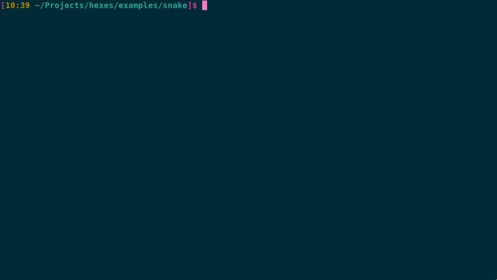

# hexes

A simple curses alternative written in go.
For now, it requires `stty` and `tput` to work.
Test the [examples](./examples/)!


## Usage

```go
package main

import (
	"time"
	"fmt"
	"unicode"
	"os"

	"github.com/hhhhhhhhhn/hexes"
)

func main() {
	duration := 2 * time.Millisecond
	r := hexes.New(os.Stdin, os.Stdout)
	r.SetDefaultAttribute(hexes.NORMAL)
	r.Start()

	for i := 0; i < 10000; i++ {
		for !unicode.IsGraphic(rune(i)) {
			i++
		}
		row := i % r.Rows
		col := (i * 4) % r.Cols

		r.Set(row, col, rune(i))
		time.Sleep(duration)

		if i % 1000 == 0 {
			r.SetAttribute(r.DefaultAttribute)
		}
		if i % 1000 == 200 {
			r.SetAttribute(hexes.RED)
		}
		if i % 1000 == 400 {
			r.SetAttribute(hexes.Join(hexes.BG_CYAN, hexes.WHITE, hexes.BOLD))
		}
		if i % 1000 == 600 {
			r.SetAttribute(hexes.Join(hexes.BG_YELLOW, hexes.RED, hexes.BOLD, hexes.ITALIC))
		}
		if i % 1000 == 800 {
			r.SetAttribute(hexes.REVERSE)
		}
	}
	r.End()
}
```

## Examples


